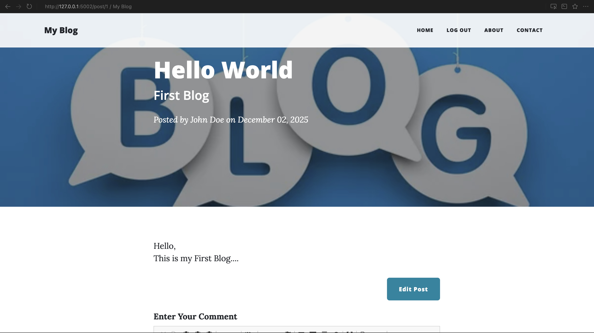

# ✍️ The Flask Blog Capstone

<p align="center">
  
  
  
  
  
</p>

<p align="center">
  <strong>
    <a href="#-getting-started">🚀 Getting Started</a>
    •
    <a href="#-features">🧩 Features</a>
    •
    <a href="#-database-architecture">🗄️ Architecture</a>
  </strong>
</p>

---

## 📖 Overview

**The Flask Blog** is a fully functional, full-stack blogging platform. Unlike simple static sites, this application features a complete **Authentication System**, **Relational Database**, and **Role-Based Access Control (RBAC)**.

It demonstrates how to manage complex relationships between **Users**, **Posts**, and **Comments** using SQLAlchemy, ensuring that data is securely linked and served dynamically.

---

## 📸 Application Preview

| **Homepage Feed** | **Article View** | **Admin Editor** |
|:---:|:---:|:---:|
|  |  |  |

---

## 🧩 Key Features

* **Authentication:** Secure Login/Register functionality using `Flask-Login` and hashed passwords (`pbkdf2:sha256`).
* **Role-Based Access Control (RBAC):** Custom `@admin_only` decorator ensures only the Admin (User ID: 1) can create, edit, or delete posts.
* **Rich Text Editor:** Integrated **CKEditor** allows for beautiful post formatting (images, bold, lists, etc.).
* **Comment System:** Authenticated users can leave comments on posts.
* **Relational Data:** Comments and Posts are automatically linked to their respective authors.
* **Responsive UI:** Built with **Bootstrap 5** for mobile-first design.

---

## 🗄️ Database Architecture

This project uses **SQLite** with **SQLAlchemy ORM** to handle complex One-to-Many relationships.

```mermaid
erDiagram
    User ||--o{ BlogPost : writes
    User ||--o{ Comment : authors
    BlogPost ||--o{ Comment : contains
    
    User {
        int id PK
        string email
        string password
        string name
    }
    BlogPost {
        int id PK
        int author_id FK
        string title
        text body
    }
    Comment {
        int id PK
        int author_id FK
        int post_id FK
        text text
    }
````

  * **Users** can write multiple **Posts**.
  * **Users** can write multiple **Comments**.
  * **Posts** can contain multiple **Comments**.

-----

## ⚙️ Tech Stack

| Component | Technology | Usage |
|-----------|------------|-------|
| **Backend** | Flask | Core web framework. |
| **Database** | SQLAlchemy | ORM for database management. |
| **Auth** | Flask-Login | Session management & user loading. |
| **Forms** | WTForms | Form validation & rendering. |
| **Frontend** | Bootstrap 5 | Styling and responsive grid. |
| **Editor** | CKEditor | WYSIWYG editor for blog content. |

-----

## 🚀 Getting Started

### Prerequisites

  * Python 3.10+
  * Pip

### Installation

1.  **Clone the repository**

    ```bash
    git clone [https://github.com/ManzarMaaz/flask-blog-capstone.git](https://github.com/ManzarMaaz/flask-blog-capstone.git)
    cd flask-blog-capstone
    ```

2.  **Create a Virtual Environment**

    ```bash
    python -m venv venv
    # Windows:
    venv\Scripts\activate
    # Mac/Linux:
    source venv/bin/activate
    ```

3.  **Install Dependencies**

    ```bash
    pip install -r requirements.txt
    ```

    *(Note: If requirements.txt is missing, install manually: `pip install flask flask-sqlalchemy flask-login flask-bootstrap flask-ckeditor flask-wtf werkzeug`)*

4.  **Run the Application**

    ```bash
    python main.py
    ```

    *The app will launch at `http://127.0.0.1:5002`*

### 👑 How to become Admin

The code is set up so that **User ID 1** is the Admin.

1.  Register a new user (this will be the first user, ID 1).
2.  You will automatically have access to the "Create Post" and "Edit" buttons.
3.  Subsequent users (ID 2, 3, etc.) will only be able to comment.

-----

## 🧠 What I Learned

Building this Capstone taught me how to move data through a full-stack application.

  * **SQLAlchemy Relationships:** I learned how to use `db.ForeignKey` and `relationship()` to link tables, allowing me to do things like `post.author.name` in my Jinja templates.
  * **Decorators:** Writing the custom `admin_only` decorator gave me a deep understanding of Python wrappers and HTTP 403 handling.
  * **Security:** Implementing secure password hashing with `werkzeug.security` instead of storing plain text.

-----

## 👤 Author

**Mohammed Manzar Maaz**

  - LinkedIn: [Mohammed Manzar Maaz](https://www.linkedin.com/in/mohammed-manzar-maaz)
  - GitHub: [ManzarMaaz](https://github.com/ManzarMaaz)

-----

## 📜 License

This project is licensed under the MIT License.
