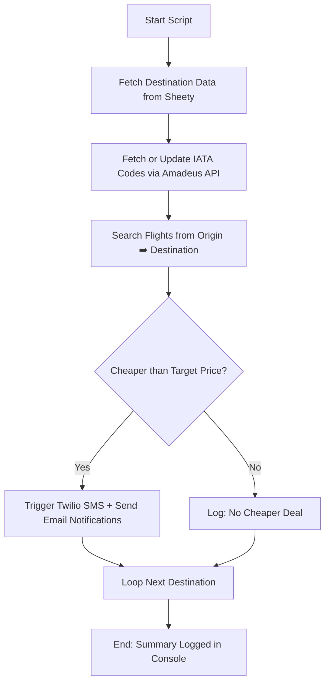

# ✈️ Flight Deal Tracker Automation 🚀


A powerful end-to-end **Flight Deal Tracker** that automates flight search, monitors price drops, and sends instant alerts via **SMS** and **Email**.  
It combines real-world APIs — **Amadeus**, **Sheety**, and **Twilio** — to provide a hands-on experience with data pipelines, API integration, and automation workflows.

> ⚠️ **Disclaimer:**  
> This project is for **educational purposes only**. Use responsibly and ensure compliance with API rate limits and platform terms.

---

## 📑 Table of Contents

- [Features](#-features)  
- [Architecture Overview](#-architecture-overview)  
- [API Interaction Map](#-api-interaction-map)  
- [Workflow Diagram](#-workflow-diagram)  
- [Tech Stack](#-tech-stack)  
- [Installation](#-installation)  
- [Environment Variables](#-environment-variables)  
- [Usage](#-usage)  
- [Impact / Learning](#-impact--learning)  
- [Future Enhancements](#-future-enhancements)  
- [License](#-license)  
- [Connect](#-connect)

---

## 🌟 Features

- Fetches city and pricing data from **Google Sheets** via **Sheety API**  
- Looks up **IATA airport codes** via **Amadeus API**  
- Searches for **direct and indirect flight offers** between two cities  
- Automatically compares **current flight price** vs **target price**  
- Sends **SMS alerts (Twilio)** and **Email notifications (SMTP)** for deals  
- Modular design with:
  - `FlightSearch` → Handles Amadeus API  
  - `FlightDataManager` → Manages Google Sheet  
  - `NotificationManager` → Sends alerts  
  - `FlightData` → Data model for each destination  

---

## 🧠 Architecture Overview

```

Google Sheet (Sheety)  ↔  FlightDataManager  ↔  FlightSearch (Amadeus)
↘
Notifier
↙
Twilio (SMS)  +  SMTP (Email)

````
---

## 🧩 Workflow Diagram



---

## 🧰 Tech Stack

| Component         | Technology Used                                               |
| ----------------- | ------------------------------------------------------------- |
| **Language**      | Python 3.10+                                                  |
| **APIs**          | Amadeus (Flight Search), Sheety (Google Sheets), Twilio (SMS) |
| **Libraries**     | requests, twilio, python-dotenv, smtplib, dataclasses         |
| **Email Service** | Gmail SMTP (or any SMTP)                                      |
| **Architecture**  | Modular OOP structure                                         |

---

## ⚙️ Installation

Clone the repository:

```bash
git clone https://github.com/ManzarMaaz/PYTHON-BOOTCAMP.git
cd PYTHON-BOOTCAMP/FlightDealTracker
```

Install dependencies:

```bash
pip install requests twilio python-dotenv
```

---

## 🔐 Environment Variables

Create a `.env` file in your project root with the following keys (replace placeholders):

```
AMADEUS_API_KEY=your_amadeus_key
API_SECRET=your_amadeus_secret
TOKEN_ENDPOINT=https://test.api.amadeus.com/v1/security/oauth2/token
CITY_SEARCH_ENDPOINT=https://test.api.amadeus.com/v1/reference-data/locations
FLIGHT_ENDPOINT=https://test.api.amadeus.com/v2/shopping/flight-offers
SHEETY_PRICES_ENDPOINT=https://api.sheety.co/your/prices
SHEETY_USERS_ENDPOINT=https://api.sheety.co/your/users
SHEETY_USERNAME=your_username
SHEETY_PASSWORD=your_password
TWILIO_SID=your_twilio_sid
TWILIO_AUTH_TOKEN=your_twilio_auth
TWILIO_VIRTUAL_NUMBER=+123456789
TWILIO_VERIFIED_NUMBER=+987654321
MY_MAIL=youremail@gmail.com
MY_PASS=yourpassword
```

> Keep `.env` out of version control (add to `.gitignore`).

---

## 🚀 Usage

Run the flight tracker:

```bash
python flight_tracker.py
```

The script will:

1. Fetch destination rows from Sheety
2. Ensure IATA codes are present (update missing ones)
3. Search for direct and indirect flights via Amadeus
4. Compare prices and send alerts when deals are below target price
5. Log results and summaries in the console

---

## 💡 Impact / Learning

* Mastery of **API authentication (OAuth 2.0)** and token handling
* Integrating **multiple APIs** into a single workflow
* Modular OOP design for maintainability and testability
* Real-world notification patterns: **SMS + Email**
* Secure credential handling with `.env`

---

## 🔮 Future Enhancements

* Add links to airline booking pages in email alerts
* Store historical deals in a DB for analytics
* Add Telegram/WhatsApp or push notifications
* Make flight API calls async for faster processing
* Add unit tests and CI checks

---

## 📜 License

This project is licensed under the **MIT License** — see `LICENSE` for details.

---

## 🌐 Connect

👤 **Mohammed Manzar Maaz**
💼 [LinkedIn](https://www.linkedin.com/in/mohammed-manzar-maaz/)
💻 [GitHub Repository](https://github.com/ManzarMaaz/PYTHON-BOOTCAMP)

---

⭐ *If this project helped you learn API integration or automation — please star the repo!*

```

---

