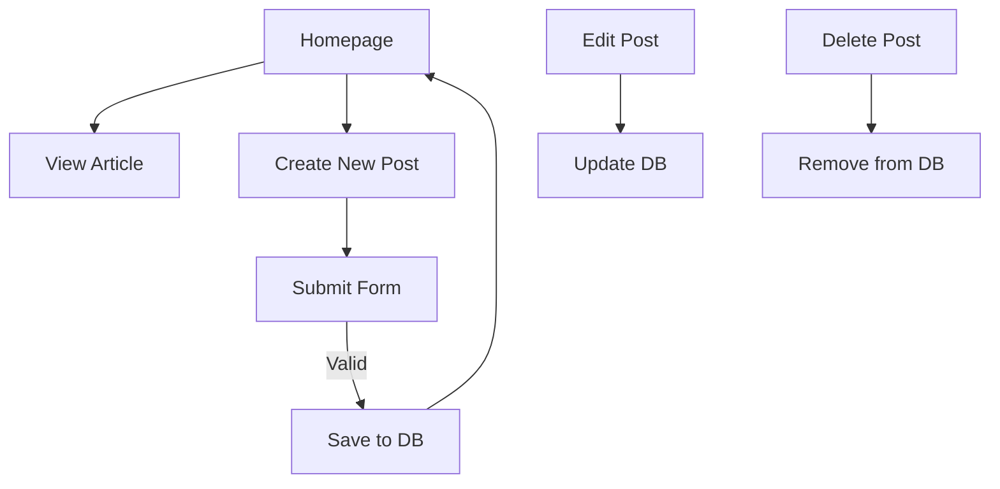

# ⚽ The Football Hub — A Flask-Powered Blog CMS for Football Articles

<p align="center">
  
  
  
  
  
  
  
</p>

A full-featured football blogging platform where you can publish match reports, tactical analysis, transfer news, and opinion pieces using a clean Flask CMS with CKEditor-rich text editing.

---

## 📸 Screenshots (Replace With Real Ones)

| Homepage | Article View | Editor |
|----------|--------------|--------|
|  |  |  |

---

## 🌟 Overview

The Football Hub is a Flask-based blogging CMS designed specifically for football content creators.

It includes:

- Dynamic post management  
- CKEditor-based rich-text editor  
- SQLite database with SQLAlchemy ORM  
- Fully themed football UI  
- Pages for About, Contact, and individual blog posts  

This is a perfect project for learning Flask CRUD operations, templates, and database architecture.

---

## 🧩 Features

- Create, edit, and delete football blog posts  
- CKEditor full rich-text article editor  
- Football-themed responsive UI  
- Auto-generated post dates  
- SQLite database with SQLAlchemy ORM  
- Category badges (Match Reports, Transfers, Tactics, Opinions)  
- Delete buttons and edit buttons per post  
- Prebuilt pages: Home, About, Contact  

---

## ⚙️ Tech Stack

| Technology | Purpose |
|-----------|---------|
| Flask | Backend web framework |
| Flask-Bootstrap | UI components |
| CKEditor | Rich-text editor |
| SQLAlchemy ORM | Database mapping |
| SQLite | DB storage |
| Jinja2 | Template rendering |
| HTML/CSS/Bootstrap | Frontend |

---

## 📁 Project Structure

```text
FootballHub/
│
├── main.py                # Flask app + routes
├── posts.db               # SQLite database
│
├── templates/             # Jinja2 templates
│   ├── index.html
│   ├── post.html
│   ├── make-post.html
│   ├── about.html
│   ├── contact.html
│   ├── header.html
│   └── footer.html
│
└── static/
    ├── assets/img         # Background images
    ├── css/styles.css
    ├── js/scripts.js
    └── README.md
````

---

## 🔌 Routes

| Route             | Method    | Description                |
| ----------------- | --------- | -------------------------- |
| `/`               | GET       | Homepage showing all posts |
| `/post/<id>`      | GET       | View single article        |
| `/new-post`       | GET, POST | Create new article         |
| `/edit_post/<id>` | GET, POST | Edit article               |
| `/delete/<id>`    | GET, POST | Delete article             |
| `/about`          | GET       | About page                 |
| `/contact`        | GET, POST | Contact page               |

---

## 🧭 Workflow Diagram



---

## 🚀 Getting Started

### 1. Clone the repo

```bash
git clone https://github.com/yourusername/football-hub.git
cd football-hub
```

### 2. Create a virtual environment

```bash
python3 -m venv venv
source venv/bin/activate  # Mac/Linux
venv\Scripts\activate     # Windows
```

### 3. Install dependencies

```bash
pip install -r requirements.txt
```

### 4. Run the server

```bash
python main.py
```

The app runs on:
[http://127.0.0.1:5003](http://127.0.0.1:5003)

---

## 🧠 Why I Built This

Football websites are everywhere — but building one yourself helps you learn:

* CRUD operations in Flask
* Rich-text editing
* SQLAlchemy ORM
* Bootstrap templating
* Real-world blog structure

This project was a perfect way to turn love for football into full-stack development practice.

---

## 📜 License

Licensed under the MIT License.

---

## 👤 Author

Mohammed Manzar Maaz
LinkedIn: [https://www.linkedin.com/in/mohammed-manzar-maaz](https://www.linkedin.com/in/mohammed-manzar-maaz)
GitHub: [https://github.com/ManzarMaaz](https://github.com/ManzarMaaz)

```
