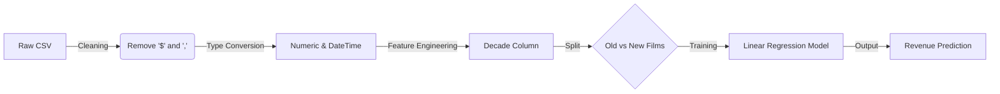

<div align="center">
  
  

  <p>
    <a href="https://www.linkedin.com/in/mohammed-manzar-maaz">
      
    </a>
    
    
  </p>

  

</div>

<h2 align="center">🎬 Overview</h2>

<p align="center">
  <b>Do higher film budgets actually guarantee box office gold?</b> <br>
  I scraped and analyzed data on thousands of movies to find the statistical relationship between <b>Production Budget</b> and <b>Worldwide Gross Revenue</b>.
</p>

<p align="center">
  Using historical data (pre-2018), this project explores:
  <br>
  💰 <b>ROI Analysis:</b> How many big-budget movies actually flop? <br>
  📉 <b>The Trend:</b> Has the correlation between budget and revenue changed over the decades? <br>
  🤖 <b>Prediction:</b> Can we build a Linear Regression model to predict a movie's revenue based solely on its budget?
</p>

<br>

<h2 align="center">📊 Key Insights & Visualizations</h2>

<table align="center">
  <tr>
    <td align="center" width="50%">
      <h3>📈 Budget vs. Revenue (Regression)</h3>
      
      <p><i>Scatter plot with a Linear Regression line showing a strong positive correlation ($R^2 \approx 0.56$) for modern films.</i></p>
    </td>
    <td align="center" width="50%">
      <h3>🕰️ Old vs. New Era</h3>
      
      <p><i>Comparison showing that while budgets have exploded since 1970, the predictability of returns has also increased.</i></p>
    </td>
  </tr>
</table>

> **💡 The Verdict:** There is a significant positive correlation, but it's not a guarantee. Our model explains about **56%** of the variance in revenue for modern films. This means while budget matters, **44%** of success depends on other factors (Marketing, Star Power, Reviews, etc.).

<br>

<h2 align="center">⚙️ Tech Stack & Tools</h2>

<p align="center">
  
</p>

<table align="center">
  <tr>
    <th>Category</th>
    <th>Technologies Used</th>
  </tr>
  <tr>
    <td align="center"><b>Data Processing</b></td>
    <td align="center"></td>
  </tr>
  <tr>
    <td align="center"><b>Visualization</b></td>
    <td align="center"></td>
  </tr>
  <tr>
    <td align="center"><b>Machine Learning</b></td>
    <td align="center"></td>
  </tr>
</table>

<br>

<h2 align="center">🧠 Engineering Decisions</h2>

<p align="center">
  Raw financial data is rarely ready for Machine Learning.
</p>


[Image of machine learning workflow]



### 🔧 Key Techniques Used

* **Data Cleaning:** The budget data came as strings (e.g., `$1,000,000`). I implemented a cleaning pipeline to strip currency symbols and convert them to integers.
* **Feature Engineering:** I created a `Decade` column using floor division (`// 10 * 10`) on the Release Date to analyze trends over 10-year periods.
* **Modeling:** I used `scikit-learn` to fit a Linear Regression model.
* **Coefficient:** Tells us that for every extra **$1** spent on budget, we can expect roughly **$3.10** in revenue (for modern films).
* **Intercept:** The baseline revenue.


<h2 align="center">🚀 Getting Started</h2>

<p align="center">To run this analysis and predict movie revenue:</p>

```bash
# 1. Clone the repository
git clone [https://github.com/ManzarMaaz/movie-revenue-prediction.git](https://github.com/ManzarMaaz/movie-revenue-prediction.git)

# 2. Install requirements
pip install pandas seaborn scikit-learn

# 3. Launch Jupyter Notebook
jupyter notebook movie_analysis.ipynb

```

<div align="center">
<h3>👤 Author: Mohammed Manzar Maaz</h3>
<p>
<a href="https://www.linkedin.com/in/mohammed-manzar-maaz">

</a>
<a href="https://github.com/ManzarMaaz">

</a>
</p>
</div>
