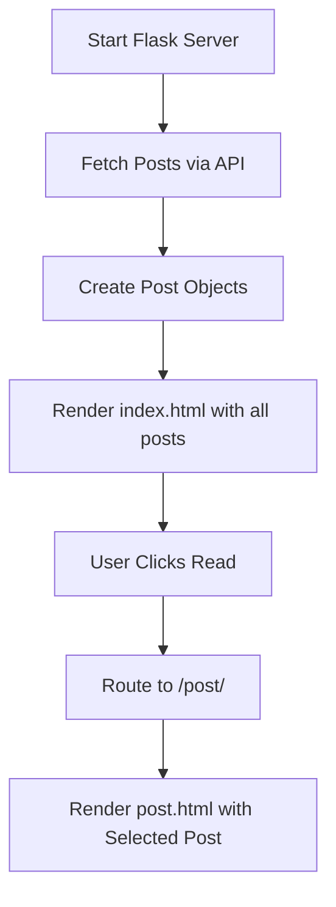

# 📰 Flask Dynamic Blog Website


A fully functional **Flask-based blog website** that dynamically loads posts from a **remote JSON API** and displays them using clean, modern templates.  
Each blog post has its own page with title, subtitle, and full content — powered by Flask routing and Jinja templating.

---

## 🪄 Features

- Fetches blog data dynamically from a **live API endpoint**  
- Uses **Flask routing** to navigate between homepage and post pages  
- Renders HTML templates with **Jinja2** for dynamic content  
- Clean, responsive front-end styling with **custom CSS**  
- Built with scalability in mind — new posts load automatically without code changes  

---

## ⚙️ Tech Stack

- **Python 3.10+**
- **Flask** — web framework  
- **Requests** — to fetch blog data  
- **HTML5 / CSS3** — front-end templates  
- **Jinja2** — template rendering engine  

---

## 📁 Project Structure

```plaintext
project/
│
├── main.py                 # Flask app and routes
├── post.py                 # Post class model
│
├── templates/
│   ├── index.html          # Homepage listing all posts
│   └── post.html           # Individual blog post page
│
└── static/
    └── css/
        └── styles.css      # Custom site styling
```

---

## 🚀 How It Works

1. **Fetch Data:**  
   On startup, the app calls a live JSON API (`https://api.npoint.io/9bd5da8c48fbe6b8c398`) to retrieve all posts.

2. **Render Homepage:**  
   Displays all posts dynamically using `index.html`.

3. **View Individual Post:**  
   Clicking “Read” on any post opens `/post/<id>` with full details.

---

## 🧩 Workflow Diagram



---

## 🖥️ Example Output

**Homepage:**
> Lists all blog titles with subtitles and “Read” links.

**Individual Post:**
> Displays the selected post’s full title, subtitle, and body text in a modern layout.

---

## 🧠 Learning Outcomes

- Hands-on experience with **Flask routing and templating**  
- Integrated **external API data** into Flask  
- Created reusable **Post class** models  
- Strengthened front-end integration using Jinja and CSS  

---

## 🏁 Run the Project

```bash
# Clone the repository
git clone https://github.com/ManzarMaaz/PYTHON-BOOTCAMP.git
cd PYTHON-BOOTCAMP

# Install dependencies
pip install flask requests

# Run the app
python main.py
```

Visit 👉 **http://127.0.0.1:5000/**

---

## 📌 Future Enhancements

- Add a “Create New Post” feature (with Flask Forms)  
- Integrate a real database (SQLite or PostgreSQL)  
- Add pagination and comments  
- Enable Markdown rendering for post content  

---

## 🔗 Connect & Explore
🌐 **LinkedIn:** [Mohammed Manzar Maaz](https://www.linkedin.com/in/mohammed-manzar-maaz/)  

---

⭐ *A perfect beginner-to-intermediate Flask project combining API integration, templating, and clean UI design.*
