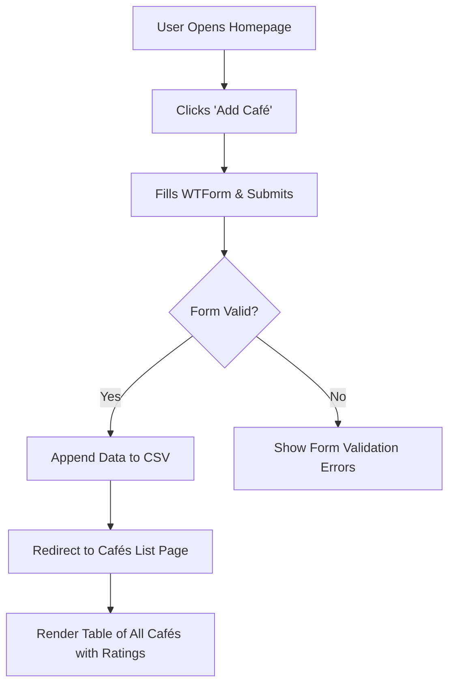

# ☕ Flask Café & Wi-Fi Rating App  

  
  
  
  
  
  

> 🏙️ **“Find the best cafés to code, sip, and stay connected.”**  
> A Flask app that lets users add and explore cafés — complete with ratings for **coffee quality**, **Wi-Fi strength**, and **power socket availability** ⚡.

---

## 🌟 Overview  

This project is a **Flask-based web app** that allows users to add their favorite cafés, along with details such as:  
☕ Coffee rating,  
📶 Wi-Fi rating, and  
🔌 Power socket rating.  

Each submission is saved to a `.csv` file, and users can browse all the cafés in a clean, responsive Bootstrap table.

---

## 🧩 Features  

- 🧾 Add café details with name, location, timings, and emoji-based ratings  
- 🗂️ Data stored efficiently in a CSV file  
- 💻 Beautiful, mobile-responsive UI with Bootstrap-Flask  
- ✅ WTForms validation for accurate submissions  
- 🧠 Modular templates with Jinja2 inheritance  

---

## ⚙️ Tech Stack  

| Component | Purpose |
|------------|----------|
| **Python (Flask)** | Web framework |
| **Flask-Bootstrap** | Quick, responsive styling |
| **WTForms** | Form creation and validation |
| **Jinja2** | Template inheritance |
| **CSV module** | Lightweight data storage |

---

## 🗂️ Project Structure  

```
FlaskCafeWiFi/
│
├── main.py                 # Flask app
├── templates/
│   ├── base.html           # Base layout
│   ├── index.html          # Homepage
│   ├── add.html            # Café form page
│   └── cafes.html          # Display list of cafés
│
├── static/
│   └── css/styles.css      # Custom styling
│
├── cafe-data.csv           # Data storage
├── requirements.txt        # Dependencies
└── README.md
```

---

## 🧭 Workflow Diagram  



---

## 🚀 Getting Started  

### 1️⃣ Install Dependencies  
```bash
pip install flask flask-bootstrap flask-wtf
```

### 2️⃣ Run the App  
```bash
python main.py
```

### 3️⃣ Open in Browser  
👉 [http://127.0.0.1:5002](http://127.0.0.1:5002)

---

## 🧠 Learning Highlights  

- Built and validated **Flask forms** using Flask-WTF  
- Stored data persistently in **CSV** without a database  
- Practiced **Jinja2 template inheritance** for cleaner HTML  
- Styled app with **Bootstrap integration**  
- Handled **form submissions and redirects** seamlessly  

---

## 🏁 Future Enhancements  

- 🗄️ Switch to SQLite or PostgreSQL for scalable storage  
- ⭐ Add user authentication for personalized submissions  
- 📍 Integrate Google Maps to show café locations  
- 📊 Implement filtering and sorting by rating  

---

## 👤 Author  

**Mohammed Manzar Maaz**  
🔗 [LinkedIn](https://www.linkedin.com/in/mohammed-manzar-maaz/)  
💻 [GitHub](https://github.com/ManzarMaaz)

---

⭐ **If this project inspired you to code over coffee, drop a star on GitHub!**
