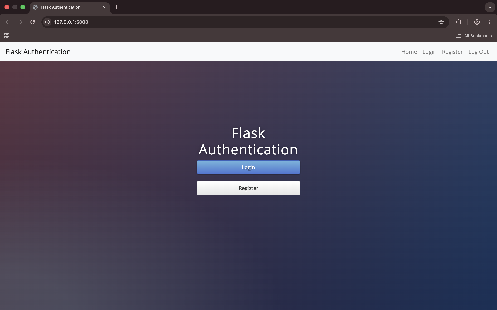
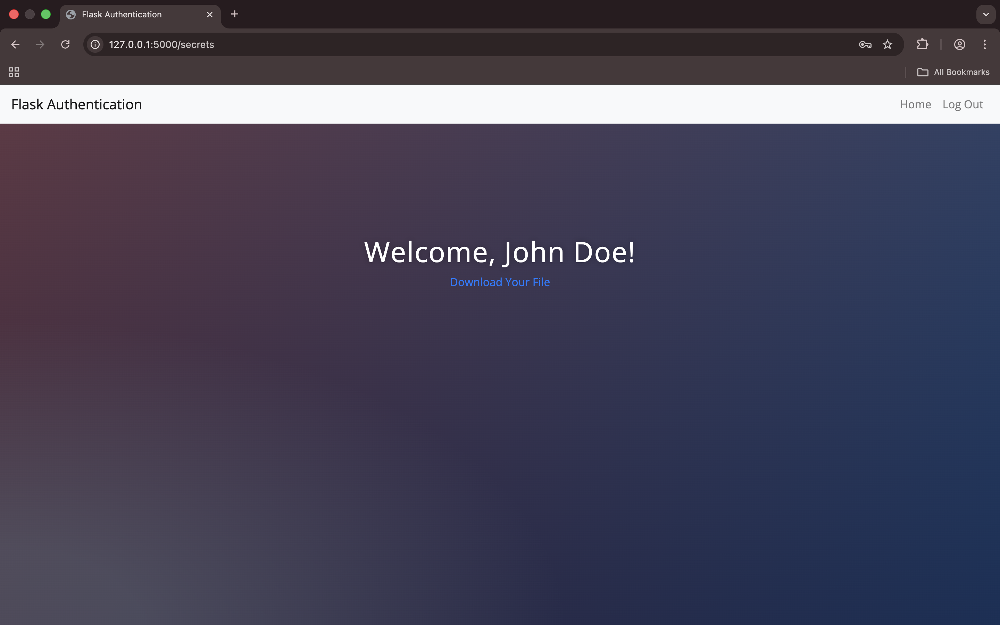

# 🔐 Flask Authentication System

<p align="center">
  
  
  
  
  
  
</p>

<p align="center">
  <strong>
    <a href="#-getting-started">🚀 Getting Started</a>
    •
    <a href="#-features">🧩 Features</a>
    •
    <a href="#-security-architecture">🛡️ Security</a>
  </strong>
</p>

---

## 📖 Overview

This is a robust **User Authentication System** built with **Flask**. Unlike simple CRUD apps, this project focuses on the security lifecycle of a user: registration, encryption, session management, and access control.

It moves away from "black box" authentication providers (like Firebase or Auth0) to demonstrate how authentication works **under the hood** using industry-standard hashing algorithms and session management.

---

## 📸 Interface Preview

| **Login Screen** | **Protected Secrets Page** |
|:---:|:---:|
|  |  |

*(Note: Screenshots above are placeholders. Please clone the repo to view the custom gradient UI).*

---

## 🛡️ Security & Architecture

This application implements **Role-Based Access Control (RBAC)** primitives and secure data storage.

### Security Features Implemented:
1.  **Password Hashing:** Uses `pbkdf2:sha256` with an 8-char salt via `Werkzeug`. Passwords are **never** stored in plain text.
2.  **Session Management:** `Flask-Login` handles user sessions, cookies, and state persistence.
3.  **Route Protection:** The `@login_required` decorator secures the `/secrets` and `/download` routes, rejecting unauthenticated traffic.
4.  **Flash Messaging:** Instant user feedback for invalid credentials or duplicate emails.
5.  **Secure File Serving:** Controlled access to static files (cheat sheets) only for logged-in users.

### 🧭 Authentication Flow
```mermaid
flowchart TD
    User((User))
    
    subgraph Frontend
    A[Register Form]
    B[Login Form]
    C[Secrets Page]
    end
    
    subgraph Backend
    D{Check DB}
    E[Hash Password + Salt]
    F[Verify Hash]
    G[Create Session]
    end
    
    subgraph Database
    H[(SQLite Users.db)]
    end

    User -->|Email/Pass| A
    A -->|Submit| D
    D -->|New User| E
    E -->|Store Hash| H
    
    User -->|Email/Pass| B
    B -->|Submit| F
    H -->|Fetch Hash| F
    F -->|Valid| G
    G -->|Grant Access| C
    F -->|Invalid| B
````

-----

## ⚙️ Tech Stack

  * **Backend:** Python, Flask
  * **Security:** Werkzeug (Hashing), Flask-Login (Sessions)
  * **Database:** SQLite, SQLAlchemy (ORM)
  * **Frontend:** HTML5, Jinja2, Bootstrap 4, Custom CSS (Gradient Themes)

-----

## 📂 Project Structure

```text
Flask-Auth/
├── main.py                # App logic, Routes, DB Models
├── instance/
│   └── users.db           # SQLite Database (Auto-generated)
├── static/
│   ├── css/
│   │   └── styles.css     # Custom Gradient Styling
│   └── files/
│       └── cheat_sheet.pdf # Protected Downloadable Content
├── templates/
│   ├── base.html          # Layout & Navigation
│   ├── index.html         # Homepage
│   ├── login.html         # Login Form
│   ├── register.html      # Registration Form
│   └── secrets.html       # Protected Content
└── requirements.txt       # Dependencies
```

-----

## 🚀 Getting Started

### Prerequisites

  * Python 3.8+
  * Pip

### Installation

1.  **Clone the repository**

    ```bash
    git clone [https://github.com/ManzarMaaz/flask-auth-system.git](https://github.com/ManzarMaaz/flask-auth-system.git)
    cd flask-auth-system
    ```

2.  **Create a Virtual Environment**

    ```bash
    python -m venv venv
    # Windows:
    venv\Scripts\activate
    # Mac/Linux:
    source venv/bin/activate
    ```

3.  **Install Dependencies**

    ```bash
    pip install -r requirements.txt
    ```

4.  **Run the Application**

    ```bash
    python main.py
    ```

    *The app will launch at `http://127.0.0.1:5000`*

-----

## 🧠 Why I Built This

Authentication is often treated as a "black box" by importing third-party tools. I wanted to understand the engineering behind it.
Building this project taught me:

  * Why **Salting** is crucial to prevent Rainbow Table attacks.
  * The difference between **Authentication** (who you are) and **Authorization** (what you can do).
  * How to structure a Flask app using **Jinja2 inheritance** to keep frontend code DRY.

-----

## 👤 Author

**Mohammed Manzar Maaz**

  - LinkedIn: [Mohammed Manzar Maaz](https://www.linkedin.com/in/mohammed-manzar-maaz)
  - GitHub: [ManzarMaaz](https://github.com/ManzarMaaz)

-----

## 📜 License

This project is licensed under the MIT License.
