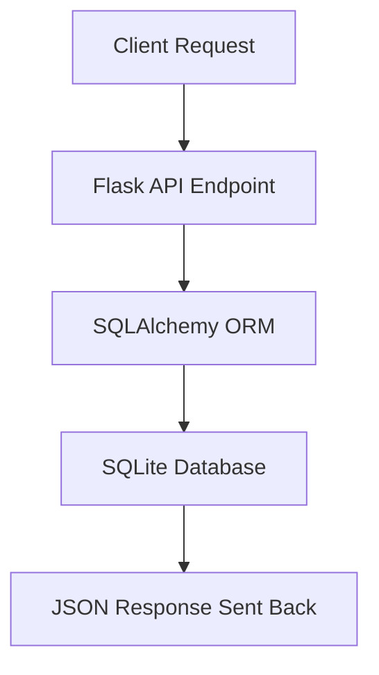

# ☕ Flask Café API  


A fully functional **Flask REST API** that manages cafés and their details — including location, amenities, pricing, and ratings.  

This project demonstrates **complete CRUD operations** (Create, Read, Update, Delete) with **Flask + SQLAlchemy ORM** and **JSON API responses**, built with clean, RESTful design.  

---

## 📜 **Table of Contents**
- [Overview](#overview)
- [Features](#features)
- [API Endpoints](#api-endpoints)
- [Tech Stack](#tech-stack)
- [Setup & Installation](#setup--installation)
- [Example Requests](#example-requests)
- [License](#license)

---

## 🧠 **Overview**
The Flask Café API allows users to:
- Retrieve random cafés  
- Search cafés by location  
- Add new café entries  
- Update coffee prices  
- Delete cafés with authentication  

All responses are **JSON-based**, making it easy to integrate with mobile apps, frontends, or data dashboards.  

---

## 🌟 **Features**
- ☕ **RESTful Endpoints** using Flask  
- 🧾 **CRUD Operations:** Create, Read, Update, Delete  
- 🧰 **SQLite Database** via SQLAlchemy ORM  
- 🔑 **Secure Delete with API Key**  
- 🎯 **JSON Responses** for clean data exchange  
- 🧠 **Error Handling** for invalid requests  

---

## ⚙️ **Tech Stack**
| Component | Technology |
|------------|-------------|
| Backend | Flask |
| Database | SQLite |
| ORM | SQLAlchemy |
| Response Format | JSON |
| Tools | Postman / cURL for API testing |

---

## 🔗 **API Endpoints**

| Method | Endpoint | Description |
|---------|-----------|-------------|
| `GET` | `/random` | Fetch a random café |
| `GET` | `/all` | Retrieve all cafés |
| `GET` | `/search?loc=London` | Search cafés by location |
| `POST` | `/add` | Add a new café entry |
| `PATCH` | `/update-price/<id>?new_price=£3.50` | Update coffee price |
| `DELETE` | `/report-closed/<id>?api_key=TopSecretAPIKey` | Delete café (secured) |

---

## 💻 **Setup & Installation**
```bash
git clone https://github.com/ManzarMaaz/PYTHON-BOOTCAMP.git
cd PYTHON-BOOTCAMP/CafeAPI
pip install -r requirements.txt
python main.py
```

Access the API locally at:
```
http://127.0.0.1:5001/
```

---

## 🧩 **Example Request**

**GET Random Café**
```bash
curl http://127.0.0.1:5001/random
```

**POST Add Café**
```bash
curl -X POST http://127.0.0.1:5001/add \
  -d "name=CoffeeHub&location=Paris&map_url=http://maps..." \
  -d "img_url=http://image..." \
  -d "wifi=True&toilet=True&sockets=True&calls=True&seats=30&coffee_price=€4.50"
```

**PATCH Update Price**
```bash
curl -X PATCH http://127.0.0.1:5001/update-price/2?new_price=€3.00
```

---

## 🧱 **Project Workflow**


---

## 🪪 **License**
MIT License © 2025 Mohammad Manzar Maaz  
Built with ☕ and ❤️ using Flask  

> “Because every good idea starts with coffee — and an API.”  
