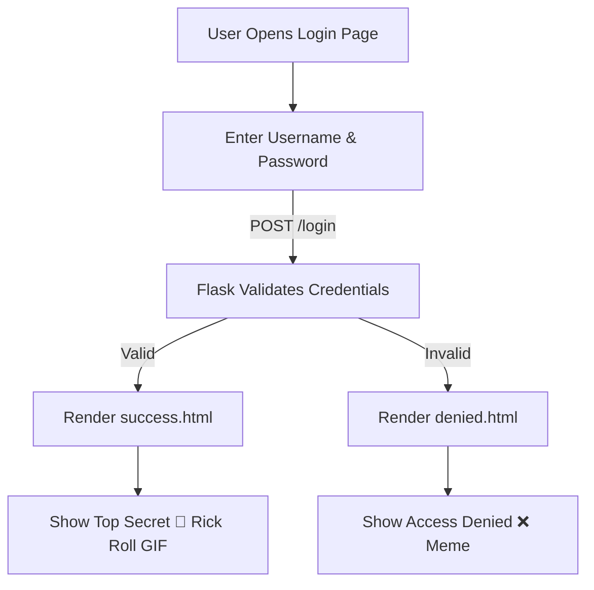

# 🔐 Flask Login Portal – Secure Access with Flask Templates  

  
  
  
  
  
  

> 🧠 “Simple login. Clear logic. No tricks — unless you fail the login 😏.”

A lightweight **Flask login authentication app** that demonstrates clean routing, HTML template inheritance, and condition-based access control — complete with fun **success** and **access denied** animations for user feedback.

---

## 🚀 Overview  

This project simulates a **secure login portal** built using Flask and Jinja2 templates.  
It validates credentials through POST requests and renders appropriate pages based on access status.  

- ✅ Successful login → Displays the “Top Secret 🚨” page (with Rick Astley GIF 😉)  
- ❌ Failed login → Redirects to an “Access Denied ❌” meme page  

---

## 🧩 Features  

- 🔒 **Basic Flask Authentication** (username/password validation)  
- 🎨 **Jinja2 Template Inheritance** via `base.html`  
- 🎬 **Interactive Feedback Pages** with embedded GIFs  
- ⚙️ **Environment Separation** using `requirements.txt`  
- 📱 **Responsive Layout** powered by Bootstrap  

---

## ⚙️ Tech Stack  

| Component | Purpose |
|------------|----------|
| **Python (Flask)** | Web framework for routing and templates |
| **Jinja2** | Template inheritance and dynamic rendering |
| **Bootstrap** | Simple responsive styling |
| **HTML/CSS** | Layout and presentation |
| **GIPHY** | Embedded GIFs for feedback |

---

## 🗂️ Project Structure  

```
FlaskLoginPortal/
│
├── main.py                # Flask app entry point
├── templates/
│   ├── base.html          # Base template
│   ├── login.html         # Login form page
│   ├── success.html       # Displayed after successful login
│   └── denied.html        # Displayed after failed login
│
├── requirements.txt       # Dependencies
└── README.md
```

---

## 🧭 Workflow Diagram  



---

## 🧠 Requirements  

Install dependencies before running the app:

```bash
pip install -r requirements.txt
```

---

## ▶️ Run the App  

```bash
python main.py
```

Then open in your browser:  
👉 [http://127.0.0.1:5000](http://127.0.0.1:5000)

---

## 💡 Learning Highlights  

- Implemented **Flask form handling** with POST method  
- Used **template inheritance (extends + block)** for DRY design  
- Handled **conditional logic** for authentication flow  
- Embedded **external content (GIFs)** for user interaction  
- Organized project in a clean, scalable structure  

---

## 🏁 Future Enhancements  

- 🔑 Add hashed password storage  
- 🧾 Integrate user session management  
- 🧱 Connect a database (SQLite/PostgreSQL)  
- 🛡️ Implement Flask-Login for multi-user auth  
- 🌐 Deploy on Render or Railway  

---

## 👤 Author  

**Mohammed Manzar Maaz**  
🔗 [LinkedIn](https://www.linkedin.com/in/mohammed-manzar-maaz/)  
💻 [GitHub](https://github.com/ManzarMaaz)  

---

⭐ **If this made you smile and taught you Flask, give it a star and share it with your network!**
