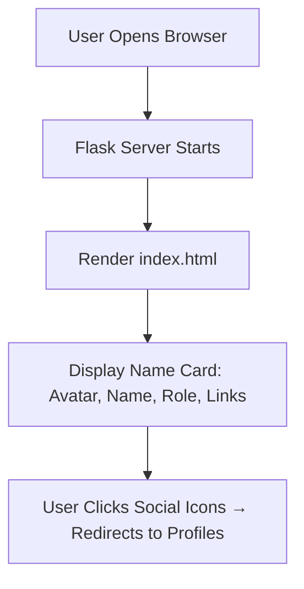

# 💳 Flask Name Card Website


A minimalist **Flask web app** that serves as a **personal name card** — clean, responsive, and professional.  
Built using **Flask** and the **HTML5 UP “Identity”** template, this project displays your name, role, and social links beautifully on a single page.

---

## 🪄 Features

- Simple **Flask server** rendering an elegant HTML name card  
- **Responsive design** that looks great on desktop or mobile  
- Includes **LinkedIn**, **GitHub**, and **Twitter** profile links  
- Customizable avatar and name/title  
- Ideal for personal branding, portfolio intros, or landing pages  

---

## ⚙️ Tech Stack

- **Python 3.10+**
- **Flask**
- **HTML5 / CSS3**
- **HTML5 UP Identity Template**

---

## 📁 Project Structure

```plaintext
project/
│
├── server.py               # Flask server
├── templates/
│   └── index.html          # HTML template (main name card)
└── static/
    ├── assets/css/         # Stylesheets
    ├── assets/js/          # JS scripts
    └── images/             # Avatar and icons
```

---

## 🚀 Run Locally

```bash
# Clone the repo
git clone https://github.com/ManzarMaaz/PYTHON-BOOTCAMP.git
cd PYTHON-BOOTCAMP

# Install Flask
pip install flask

# Run the server
python server.py
```

Then open **http://127.0.0.1:5000/** in your browser.

---

## 🎨 Customization

To personalize your card:
- Change your **name**, **title**, and **avatar** in `index.html`
- Add or update **social links** in the `<footer>` section
- Modify styles in `static/assets/css/main.css`

---

## 🧠 Learning Outcomes

- Learned how to serve **static HTML templates with Flask**
- Gained hands-on experience in structuring Flask apps
- Practiced embedding **HTML5 UP templates** into Python projects
- Strengthened understanding of **Flask routing and template rendering**

---

## 🧩 Workflow Diagram



---

## 🪪 Example Output

🖥️ A clean personal webpage displaying:  
**“Mohammad Manzar Maaz – Software Developer”**  
with social links & responsive layout.

---

## 📂 Repository

🔗 **GitHub:** [ManzarMaaz/PYTHON-BOOTCAMP](https://github.com/ManzarMaaz/PYTHON-BOOTCAMP)

---

⭐ *A perfect starter Flask project to host your digital identity!*
