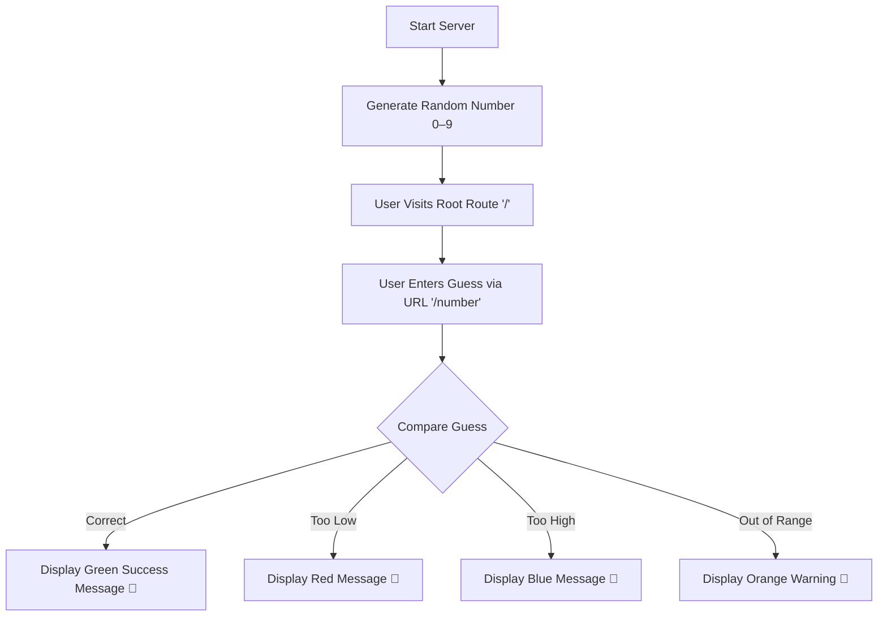

# 🎯 Flask Number Guessing Game 🚀


A fun, interactive **Flask web app** that lets users guess a random number between **0 and 9** — all through their browser!  
Perfect for learning **Flask routing**, **dynamic URL handling**, and building simple yet engaging **Python web applications**.

> ⚠️ **Disclaimer:** This project is for **educational purposes only** and designed to demonstrate Flask fundamentals and interactive logic flow.

---

## 🧭 Table of Contents

- [Features](#features)
- [Tech Stack](#tech-stack)
- [Workflow Diagram](#workflow-diagram)
- [Installation](#installation)
- [Usage](#usage)
- [Learning Highlights](#learning-highlights)
- [Impact / Results](#impact--results)
- [Future Enhancements](#future-enhancements)
- [License](#license)
- [Connect](#connect)

---

## ✨ Features

- Generates a **random number** between 0–9 on each server start  
- Uses **Flask dynamic routing** to handle guesses via URL  
- Displays **color-coded messages** and **GIFs** for user feedback  
- Responds with:  
  - 🎉 **Correct Guess**
  - 🔺 **Too Low**
  - 🔻 **Too High**
  - 🚫 **Out of Range**  
- Lightweight — no database or templates required  

---

## 🧩 Tech Stack

| Component | Technology |
|------------|-------------|
| **Language** | Python 3 |
| **Framework** | Flask |
| **Libraries** | Random |
| **Frontend** | Inline HTML + GIPHY GIFs |

---

## 🧠 Workflow Diagram



---

## ⚙️ Installation

1. Clone the repository:
   ```bash
   git clone https://github.com/ManzarMaaz/PYTHON-BOOTCAMP.git
   cd PYTHON-BOOTCAMP
   ```
2. Install Flask:
   ```bash
   pip install flask
   ```

---

## 🚀 Usage

1. Run the application:
   ```bash
   python app.py
   ```
2. Open your browser and visit:
   ```
   http://127.0.0.1:5000/
   ```
3. Start guessing by adding numbers to the URL:
   ```
   http://127.0.0.1:5000/5
   ```
4. Watch the app respond dynamically with fun visuals and hints!

---

## 🧠 Learning Highlights

- Flask **route decorators** and URL parameter handling  
- Dynamic HTML generation from Python functions  
- Building **interactive web responses**  
- Basics of **server-side state** and debugging Flask apps  

---

## 💡 Impact / Results

- Built a lightweight **Flask web game** that responds in real-time  
- Demonstrated fundamentals of **web routing** and **response rendering**  
- Great foundation for learning **Flask templates, forms, and sessions**  

---

## 🧭 Future Enhancements

- Add input form (instead of URL guessing)  
- Track user attempts and scores  
- Extend to higher ranges and difficulty levels  
- Implement leaderboard or session tracking  

---

## 📜 License

This project is licensed under the **MIT License** — free to use and modify.

---

## 🔗 Connect

👨‍💻 **Developed by:** *Mohammed Manzar Maaz*  
💼 **LinkedIn:** [Mohammed Manzar Maaz](https://www.linkedin.com/in/mohammed-manzar-maaz/)  

⭐ Don’t forget to star the repo and share your feedback!  
