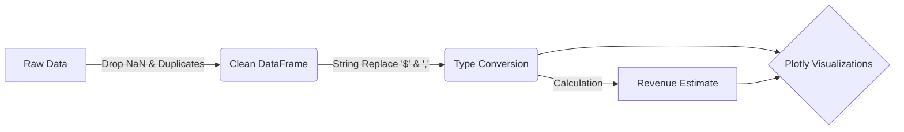

<div align="center">
  
  

  <p>
    <a href="https://www.linkedin.com/in/mohammed-manzar-maaz">
      
    </a>
    
    
  </p>

  

</div>

<h2 align="center">📱 Overview</h2>

<p align="center">
  <b>What makes an app successful on the Google Play Store?</b> <br>
  I conducted a comprehensive analysis of the Android App Market to compare thousands of apps and uncover the recipe for success.
</p>

<p align="center">
  Using a scraped dataset of over <b>10,000 apps</b>, this project explores:
  <br>
  💸 <b>Monetization:</b> How much revenue do Paid Apps actually generate? <br>
  📉 <b>The "Free" Advantage:</b> How many downloads do you lose by charging for your app? <br>
  🎮 <b>Category Dominance:</b> Which app categories have the fiercest competition?
</p>

<br>

<h2 align="center">📊 Key Insights & Visualizations</h2>

<table align="center">
  <tr>
    <td align="center" width="50%">
      <h3>📉 The "Paid" Penalty</h3>
      
      <p><i>Box plot showing the massive drop in median downloads when an app switches from Free to Paid.</i></p>
    </td>
    <td align="center" width="50%">
      <h3>☁️ Category Concentration</h3>
      
      <p><i>Scatter plot revealing that while <b>Tools</b> and <b>Entertainment</b> have many apps, <b>Photography</b> punches above its weight in downloads.</i></p>
    </td>
  </tr>
</table>

> **💡 The Verdict:** The "Game" category is the most competitive but also the most lucrative. However, for Paid Apps, the median number of installs drops precipitously compared to Free Apps, suggesting a "Freemium" model is superior for reach.

<br>

<h2 align="center">⚙️ Tech Stack & Tools</h2>

<p align="center">
  
</p>

<table align="center">
  <tr>
    <th>Category</th>
    <th>Technologies Used</th>
  </tr>
  <tr>
    <td align="center"><b>Core Analysis</b></td>
    <td align="center"></td>
  </tr>
  <tr>
    <td align="center"><b>Visualization</b></td>
    <td align="center"></td>
  </tr>
  <tr>
    <td align="center"><b>Data Cleaning</b></td>
    <td align="center"></td>
  </tr>
</table>

<br>

<h2 align="center">🧠 Engineering Decisions</h2>

<p align="center">
  Real-world data is messy. A significant portion of this project involved <b>Data Cleaning</b> before any analysis could begin.
</p>



### 🔧 Key Techniques Used

* **Data Cleaning:** The `Installs` column was stored as strings (e.g., `"1,000,000+"`). I used string manipulation to strip special characters and convert them to integers for analysis.
* **Logarithmic Scales:** Since app downloads range from 0 to 1 Billion, standard charts were unreadable. I utilized `yaxis=dict(type='log')` in Plotly to visualize this massive variance clearly.
* **Nested Data Extraction:** The `Genres` column contained nested data (e.g., "Art;Pretend Play"). I split and stacked these values to accurately count genre popularity.


<h2 align="center">🚀 Getting Started</h2>

<p align="center">To run this analysis on your local machine:</p>

```bash
# 1. Clone the repository
git clone [https://github.com/ManzarMaaz/google-play-analysis.git](https://github.com/ManzarMaaz/google-play-analysis.git)

# 2. Install requirements
pip install pandas plotly

# 3. Launch Jupyter Notebook
jupyter notebook main.ipynb

```

<div align="center">
<h3>👤 Author: Mohammed Manzar Maaz</h3>
<p>
<a href="https://www.linkedin.com/in/mohammed-manzar-maaz">

</a>
<a href="https://github.com/ManzarMaaz">

</a>
</p>
</div>
