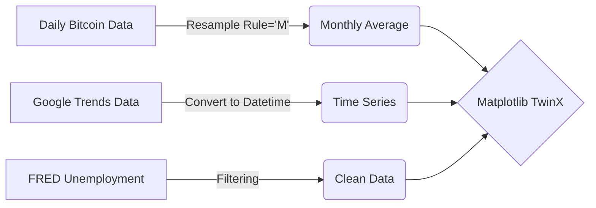

<div align="center">
  
  

  <p>
    <a href="https://www.linkedin.com/in/mohammed-manzar-maaz">
      
    </a>
    
    
  </p>

  

</div>

<h2 align="center">📉 Overview</h2>

<p align="center">
  <b>Can Google Search volume predict the stock market or the economy?</b> <br>
  I analyzed over 15 years of data to find the correlation between <b>search popularity</b> and <b>real-world metrics</b>.
</p>

<p align="center">
  Using data from <a href="https://trends.google.com/">Google Trends</a>, <a href="https://finance.yahoo.com/">Yahoo Finance</a>, and <a href="https://fred.stlouisfed.org/">FRED</a>, this project investigates:
  <br>
  🚗 <b>Tesla:</b> Does online hype correlate with stock price? <br>
  💰 <b>Bitcoin:</b> Is crypto volatility driven by search interest? <br>
  💼 <b>Unemployment:</b> Can search data predict the unemployment rate better than the government?
</p>

<br>

<h2 align="center">📊 Key Insights & Visualizations</h2>

<table align="center">
  <tr>
    <td align="center" width="50%">
      <h3>🚗 Tesla Stock vs. Hype</h3>
      
      <p><i>Strong correlation between Search Trend (Blue) and Stock Price (Green).</i></p>
    </td>
    <td align="center" width="50%">
      <h3>💰 Bitcoin Price Volatility</h3>
      
      <p><i>Search spikes often align with massive price rallies and crashes.</i></p>
    </td>
  </tr>
  <tr>
    <td align="center" colspan="2">
      <h3>📉 Unemployment: A Leading Indicator?</h3>
      
      <p><i>The "Unemployment Benefits" search term (Green) often spikes <b>before</b> the official UNRATE (Red) rises, making it a valuable leading indicator.</i></p>
    </td>
  </tr>
</table>

> **💡 The Verdict:** Google Trends data is a powerful **Leading Indicator**. In the case of unemployment, search volume spiked weeks before the official government data reflected the 2020 crisis.

<br>

<h2 align="center">⚙️ Tech Stack & Tools</h2>

<p align="center">
  
</p>

<table align="center">
  <tr>
    <th>Category</th>
    <th>Technologies Used</th>
  </tr>
  <tr>
    <td align="center"><b>Core Logic</b></td>
    <td align="center"></td>
  </tr>
  <tr>
    <td align="center"><b>Data Processing</b></td>
    <td align="center"></td>
  </tr>
  <tr>
    <td align="center"><b>Visualization</b></td>
    <td align="center"></td>
  </tr>
</table>

<br>

<h2 align="center">🧠 Engineering Decisions</h2>

<p align="center">
  Handling disparate time-series data required robust preprocessing.
</p>



🔧 Key Techniques Used

Resampling Time Series: Bitcoin price data was available daily, while Google Trends was monthly. I used df.resample('M').mean() to downsample the Bitcoin data for an accurate apple-to-apple comparison.

Dual-Axis Plotting (TwinX): Comparing "Search Volume" (0-100) with "Stock Price" ($0-$600) on one chart is impossible. I used plt.twinx() to create two independent Y-axes sharing the same X-axis (Time).

Rolling Averages: To smooth out the noise in the Unemployment search data, I applied a 6-month Rolling Average (df.rolling(window=6).mean()), which revealed the underlying trend clearer than the raw data.


<h2 align="center">🚀 Getting Started</h2>

<p align="center">To run this analysis on your local machine:</p>

```Bash
# 1. Clone the repository
git clone [https://github.com/ManzarMaaz/google-trends-analysis.git](https://github.com/ManzarMaaz/google-trends-analysis.git)

# 2. Install requirements
pip install pandas matplotlib

# 3. Launch Jupyter Notebook
jupyter notebook main.ipynb
```
<div align="center">
  <h3>👤 Author: Mohammed Manzar Maaz</h3>
  <p><a href="https://www.linkedin.com/in/mohammed-manzar-maaz">
     </a> 
    <a href="https://github.com/ManzarMaaz">  </a> 
  </p> 
</div>

