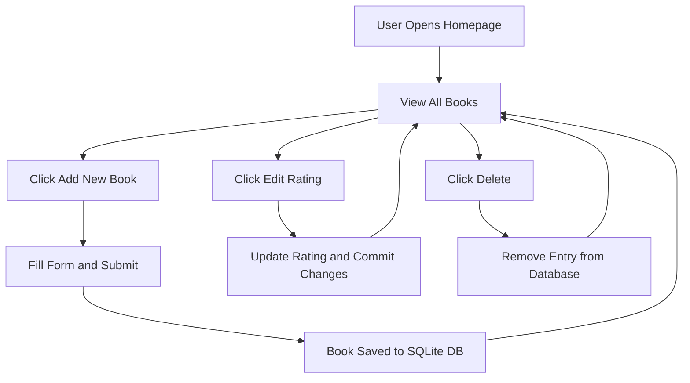

# 📚 Flask Library Manager – CRUD App with SQLAlchemy  

  
  
  
  
  
  

> ✨ “Because every developer needs a clean, simple library to track what they’ve read — and what’s next.”  

A lightweight **Flask + SQLAlchemy** app that performs full CRUD operations (Create, Read, Update, Delete) on a book database.  
With Bootstrap integration, clean routes, and real-time database updates, this project is a foundation for any beginner exploring **Flask ORM and web forms**.  

---

## 🌟 Overview  

The **Flask Library Manager** lets you:  
📘 Add new books  
✏️ Edit ratings  
❌ Delete books  
📖 View all entries in a simple, responsive list  

All data is stored in a **SQLite database**, handled efficiently via **SQLAlchemy ORM**, with models and schema defined using **Declarative Mapping**.  

---

## 🧩 Features  

- 🧾 **Full CRUD Functionality** – Add, update, and delete books easily  
- 🧠 **SQLAlchemy ORM** – Model-based database access  
- 💾 **SQLite Integration** – Lightweight, fast, and persistent  
- 🎨 **Bootstrap Styling** – Clean and minimal interface  
- 🧩 **Declarative Mapping** – Explicit model schema with type hints  

---

## ⚙️ Tech Stack  

| Component | Purpose |
|------------|----------|
| **Flask** | Web framework & routing |
| **Flask-SQLAlchemy** | ORM for managing the SQLite database |
| **Flask-Bootstrap** | UI styling |
| **SQLite** | Persistent data storage |
| **Jinja2** | HTML templating |

---

## 🗂️ Project Structure  

```
FlaskLibraryManager/
│
├── main.py              # Flask app (all routes and DB config)
├── templates/
│   ├── index.html       # Homepage showing all books
│   ├── add.html         # Add new book
│   └── edit.html        # Edit rating
│
├── static/
│   └── css/             # (Optional) Custom styling
├── new-books-collection.db  # SQLite database
├── requirements.txt
└── README.md
```

---

## 🧭 Workflow Diagram  



---

## 🚀 Getting Started  

### 1️⃣ Install Dependencies  
```bash
pip install flask flask-bootstrap flask-sqlalchemy
```

### 2️⃣ Run the App  
```bash
python main.py
```

### 3️⃣ Visit in Browser  
👉 [http://127.0.0.1:5001](http://127.0.0.1:5001)

---

## 🧠 Learning Highlights  

- Mastered **Flask routing with GET & POST methods**  
- Built an **SQLAlchemy model class** with type-safe mappings  
- Practiced **CRUD operations** with ORM commits  
- Integrated **Bootstrap styling** for simple UI  
- Used **Declarative Base** and modern SQLAlchemy syntax  

---

## 🏁 Future Enhancements  

- 🔍 Add search and filter functionality  
- ⭐ Add “Favorite Books” tagging  
- 🔑 Add login/auth for multiple users  
- 📊 Include pagination and sorting  
- 🌐 Deploy to Render or Railway  

---

## 👤 Author  

**Mohammed Manzar Maaz**  
🔗 [LinkedIn](https://www.linkedin.com/in/mohammed-manzar-maaz/)  
💻 [GitHub](https://github.com/ManzarMaaz)

---

⭐ **If this project helped you understand Flask + SQLAlchemy, give it a star!**
