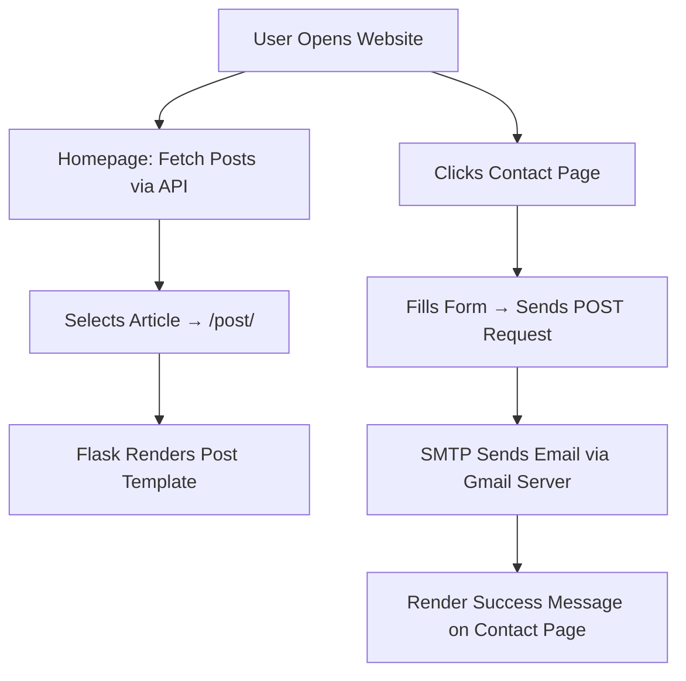

# ⚽ Matchday Pulse – Dynamic Flask Blog with API & Email Integration  

  
  
  
  
  
  

> ⚡ “Your daily heartbeat of football news.”  
> **Matchday Pulse** is a **Flask-powered blog** that fetches live football articles via an external REST API, renders them dynamically, and even lets users send **real emails** directly from a contact form.

---

## 🏟️ Overview  

**Matchday Pulse** delivers football content dynamically — no database needed.  
Posts are fetched via API, templates are rendered through **Jinja2**, and user messages are securely delivered through **SMTP email automation**.  

This project demonstrates real-world Flask integration:  
➡️ REST API data  
➡️ Reusable template structure  
➡️ Environment-based email system  

---

## 🧩 Features  

- 🌍 **Dynamic Content** – Fetches football posts from an external API  
- 💌 **Email Contact Form** – Sends real messages via SMTP (Gmail integration)  
- 🧠 **Modular Jinja Templates** – Reusable header and footer  
- 📱 **Responsive Design** – Powered by Bootstrap 5  
- 🔐 **Environment Variables** – Secure credentials with `.env`  
- ⚽ **Category-Ready Structure** – Easy to expand for more content sources  

---

## ⚙️ Tech Stack  

| Component | Purpose |
|------------|----------|
| **Python (Flask)** | Backend framework & routing |
| **Requests** | API fetching |
| **Bootstrap 5** | Responsive frontend |
| **Jinja2** | Template rendering |
| **smtplib** | Email handling |
| **dotenv** | Environment configuration |

---

## 🗂️ Project Structure  

```
MatchdayPulse/
│
├── main.py                     # Core Flask app
├── templates/
│   ├── index.html              # Homepage (dynamic posts)
│   ├── post.html               # Individual article view
│   ├── about.html              # About page
│   ├── contact.html            # Contact form (with POST method)
│   ├── header.html             # Navbar
│   └── footer.html             # Footer and social links
│
├── static/
│   ├── assets/img/             # Background images, icons
│   ├── css/styles.css          # Theme styles
│   └── js/scripts.js           # Optional interactivity
│
├── .env                        # Email credentials
└── README.md
```

---

## 🧠 Environment Variables  

Create a `.env` file in the project root:  

```
EMAIL_ADDRESS=youremail@example.com  
EMAIL_PASSWORD=yourpassword  
TARGET_EMAIL=recipient@example.com  
```

---

## 🧭 Workflow Diagram  



---

## 🚀 Getting Started  

### 1️⃣ Clone Repository  
```bash
git clone https://github.com/ManzarMaaz/MatchdayPulse.git
cd MatchdayPulse
```

### 2️⃣ Install Dependencies  
```bash
pip install flask requests python-dotenv
```

### 3️⃣ Run the App  
```bash
python main.py
```

Then open 👉 [http://127.0.0.1:5001](http://127.0.0.1:5001)

---

## 💡 Learning Highlights  

- Integrated **REST APIs** seamlessly into Flask routes  
- Configured **real email delivery** using `smtplib` + Gmail SMTP  
- Implemented **secure environment variables**  
- Practiced **modular template architecture**  
- Balanced **frontend design with backend logic**  

---

## 🏁 Future Enhancements  

- 🗞️ Add comment system & database for user feedback  
- 🧠 Integrate live football scores via external APIs  
- 🕹️ Add admin panel for managing posts  
- 📸 Include image uploads & category filters  

---

## 👤 Author  

**Mohammed Manzar Maaz**  
🔗 [LinkedIn](https://www.linkedin.com/in/mohammed-manzar-maaz/)  
💻 [GitHub](https://github.com/ManzarMaaz)  

---

⭐ **If this project kicked off your curiosity, give it a star and share it with your developer circle!**
