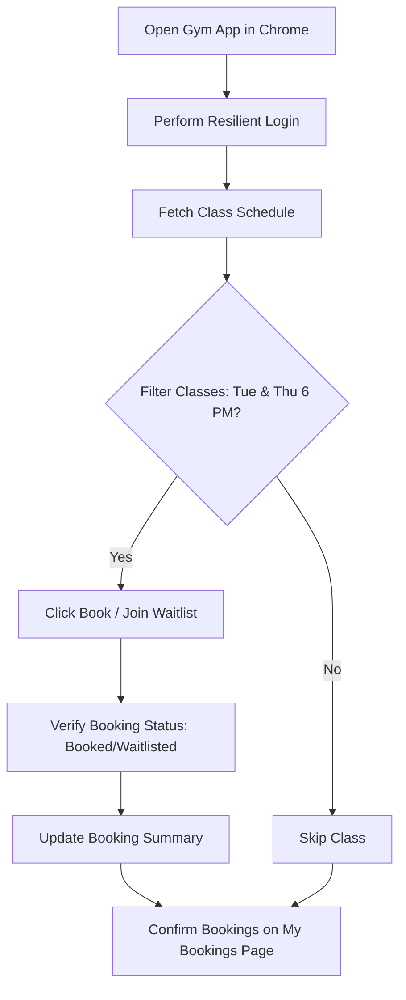

# Gym Class Booking Automation Bot 🚀


A Python Selenium bot that automates booking gym classes for specific days and times. Perfect for learning **web automation**, **Python scripting**, and handling **dynamic web elements** and **browser sessions** efficiently.

> ⚠️ **Disclaimer:** Use responsibly. Automating actions may violate platform policies. This project is for **educational purposes only**.

---

## Table of Contents

- [Features](#features)  
- [Workflow Diagram](#workflow-diagram)  
- [Tech Stack](#tech-stack)  
- [Installation](#installation)  
- [Usage](#usage)  
- [Configuration](#configuration)  
- [Impact / Results](#impact--results)  
- [Contributing](#contributing)  
- [License](#license)  
- [Demo](#demo)

---

## Features

- Automated login with retries for reliability  
- Scan class schedules and filter specific days & times (Tue/Thu 6 PM)  
- Book classes or join waitlists automatically  
- Resilient handling of dynamic web elements and browser sessions  
- Verification of bookings on "My Bookings" page  

---

## Workflow Diagram


This diagram shows the automated flow from login to booking verification.
## Tech Stack
- Language: Python 3.x
- Libraries: Selenium
- Browser: Chrome (via ChromeDriver)
## Installation
1. Clone the repository:
```bash
git clone https://github.com/yourusername/gym-class-booking-bot.git
cd gym-class-booking-bot
```
2. Install dependencies:
```bash
pip install selenium
```
3. Download ChromeDriver compatible with your Chrome version:
ChromeDriver Downloads
4. Update ACCOUNT_EMAIL and ACCOUNT_PASS in the script.
5. Manually log in to Chrome before running the bot.
## Usage
```bash
python gym_booking_bot.py
```
1. Bot logs in to the gym app
2. Scans Tuesday & Thursday 6 PM classes
3. Books or joins waitlists automatically
4. Verifies bookings on "My Bookings" page
## Configuration
- Account Credentials: Set ACCOUNT_EMAIL and ACCOUNT_PASS
- Chrome Profile: Uses chrome_profile folder for session persistence
- Target Classes: Adjust filtering logic for days/times
## Impact / Results
- Automates repetitive class booking tasks in minutes
- Strengthened skills in web automation, Python scripting, and efficient session management
- Resilient to network and element load failures with retry mechanism
## Contributing
Contributions are welcome!
1. Fork the repository
2. Submit improvements or bug fixes via pull request
## License
MIT License
## Demo

