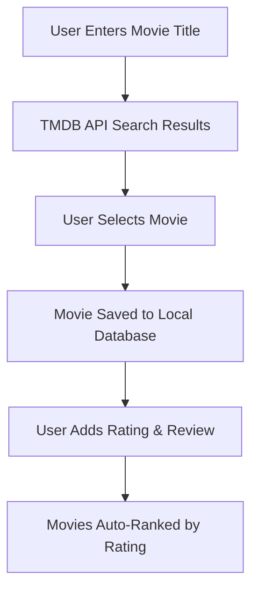

# 🎬 Top 10 Movies — Flask App  


A sleek **Flask + SQLAlchemy** web app that lets you **search, add, rate, and manage** your *Top 10 Favorite Movies* using live data from **The Movie Database (TMDB API)** 🎥  

> Rate, review, and rank your movie collection — all from your browser.  

---

## 📜 **Table of Contents**
- [Overview](#overview)
- [Features](#features)
- [Tech Stack](#tech-stack)
- [Workflow](#workflow)
- [Installation](#installation)
- [Usage](#usage)
- [API Integration](#api-integration)
- [Screenshots](#screenshots)
- [License](#license)

---

## 🧠 **Overview**
The app uses **Flask** with **SQLAlchemy ORM** to store movie data, allowing users to:
- Search movies via **TMDB API**
- Add them to a local database
- Rate & review each movie
- Automatically sort and rank movies by rating  

It’s a compact yet powerful demonstration of **Flask forms, API requests, and CRUD operations**.

---

## 🌟 **Features**
- 🔍 Search any movie via **TMDB API**
- 🧾 Add movies to your **personal database**
- ⭐ Rate and review films directly from the browser
- 🏆 Auto-ranking system based on your ratings
- 🧰 Built with **Flask-WTF** forms and **Bootstrap 5 UI**
- 💾 Uses **SQLite** for lightweight local storage

---

## ⚙️ **Tech Stack**
| Component | Technology |
|------------|-------------|
| Backend | Flask, SQLAlchemy ORM |
| Frontend | Bootstrap 5, Jinja2 Templates |
| Forms | Flask-WTF, WTForms |
| API | TMDB REST API |
| Database | SQLite |
| Auth | Environment Variables (.env via `python-dotenv`) |

---

## 🔄 **Workflow Diagram**



---

## 🚀 **Installation**

```bash
git clone https://github.com/ManzarMaaz/PYTHON-BOOTCAMP.git
cd PYTHON-BOOTCAMP/Top10Movies
pip install -r requirements.txt
```

Create a `.env` file:
```env
API_KEY=your_tmdb_api_key
API_TOKEN=your_tmdb_bearer_token
SECRET_KEY=your_flask_secret
```

Run the app:
```bash
python main.py
```

---

## 🧩 **Usage**
1. Visit the homepage to view your ranked movie list.  
2. Click **“Add Movie”** → search any film by title.  
3. Select the movie → add your rating & review.  
4. Movies are ranked automatically.  
5. Edit or delete entries anytime!  

---

## 🔑 **API Integration**
- Fetches movie data from **TMDB API**
- Uses **Bearer Authentication** for secure requests
- Auto-handles movie poster URLs and metadata  

---

## 📸 **Screenshots**
| Home | Add | Edit |
|------|-----|------|
|  |  |  |

---

## 🪪 **License**
MIT License © 2025 Mohammad Manzar Maaz  
Designed & Developed with ❤️ using **Flask**

---

> “Because every developer deserves their own IMDb.” 🎞️  
